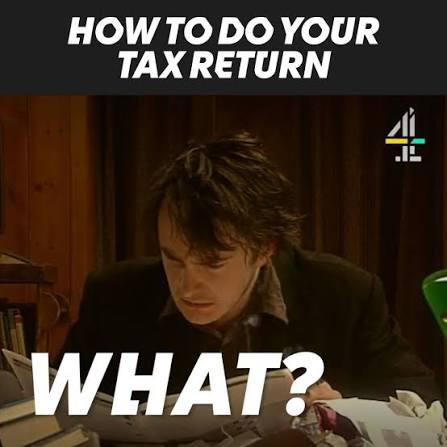

# README


This is an app for all the poor souls who happen to pay their own taxes and social security in the Republic of Bulgaria. Only for the **self-employed** people who know what they're doing!
Check if this is your case: https://nra.bg/wps/portal/nra/osiguryavane/osiguryavam-se-sam#osigurqvam-se-sam0

App language: **BG only**!

The app can help you generate Declarations One and Six that can then be submitted to the NRA portal. You can also calculate your taxes and keep track of your general income.
The Declarations output is the same as the original NRA software gives you, but hopefully the interface is slightly better.

The data is stored locally in the user's directory. 



(Dylan Moran, the one and only)

## I just want to run the program

You'll need to download this repo and go into the `bumashtina` directory.

### Windows
Open your terminal and run: `./build/bin/bumashtina.exe`

### Mac
Open your terminal and run: `open ./build/bin/Bumashtina.app`

### Linux (tested on Ubuntu)
Open your terminal and run: `./build/bin/bumashtina`

## I want to customize or contribute

Cool! The tech stack is Wails plus Svelte.

The following are the standard Wails commands for development. See Wails docs for more: https://wails.io/docs/introduction
The current framework version is 2.12.0.

### Run dev

```
wails dev
```

*If go is not in PATH:*

```
export PATH=$PATH:$(go env GOPATH)/bin
source ~/.bashrc
```

### Live Development

If you want to develop in a browser
and have access to your Go methods, there is also a dev server that runs on http://localhost:34115. Connect to this in your browser, and you can call your Go code from devtools.

### Building

To build a redistributable, production mode package, use `wails build`. See Wails docs for details: https://wails.io/docs/reference/cli#build 
On Ubuntu 24 you might have to build with tag:
`wails build -tags webkit2_41`
